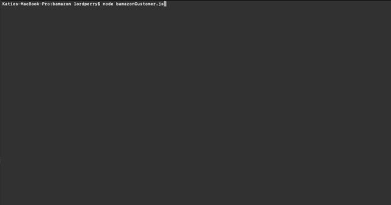

# bamazon-node-app
Amazon-like storefront application using node and the MySQL npm package. The app takes in orders from customers and depletes stock from the store's inventory, as well as allows managers to add inventory and new products to the store.

### Overview
LIRI is a command line node app that takes in  `product` and `quantity` parameters. Using the `inquirer` and `MySQL` npm packages, bamazon then is able to update the database with the inventory changes based on the user's inputs.

### How to Use
To use Bamazon, you will first need to install the npm package dependencies for `inquirer` and `MySQL`. Then once you run [node bamazonCustomer] or [node bamazonManager] in the terminal, the app will immediately provide a list of actions from which to choose.

#### Bamazon Customer Reference Guide
The available actions available to choose from as a Customer are as follows:
* `SHOP ALL`
    * If you select this option, it then will display the table for all available items to purchase, including their ID. The next prompt will ask you to enter the ID for the item you'd like to purchase.
    * After you select the ID of the product you'd like to purchase, it will then ask you to enter the desired quantity you would like to purchase.
        * If there is not enough available stock to fulfill the order, you will receive an error message. Otherwise your order will be placed!
* `EXIT`
    * If you select this option, you exit out of the application and will receive a thank you message for visiting the store.

#### Bamazon Manager Reference Guide
The available actions available to choose from as a Manager are as follows:
* `View Products for Sale`
    * If a manager selects this, the app will display the products table in the console of all of the items available to purchase in the bamazon Database.
* `View Low Inventory`
    * If a manager selects this, the app will display the proudcts table in the console of any items that have on hand inventory of 10 units or less.
* `Add to Inventory`
    * Selecting this option allows the manager to update the on hand quantities in the products table in the bamazon Database. First the manager will select the ID # for the product they are updating, and then they will submit the quantity of units being added to that item's current on-hand inventory. Then the database is updated with this information and the products table is again displayed in the console with the updated information.
* `Add New Product`
    * Selecting this option allows the manager to add a new product to the products table in the bamazon Database. The manager is then led through several prompts to get the following information:
        * product_name
        * department_name
        * price
        * stock_quantity
    After this information is submitted by the manager, this new product is added to the bamazon Databass and the products table is again displayed in the console with the updated information.

* `Exit`
     * If you select this option, you exit out of the application and will receive a message that the manager has logged out.        
        
### GIF Demonstration
Below are screenshare `.gif` files showing the working app.

#### Customer Making a Purchase:

#### Customer Exiting the Application:

#### Customer Attempting to Purchase an Item Out of Stock:

#### Manager Viewing Products Available and Checking for Low Inventory:

#### Manager Adding Inventory:

#### Manager Adding New Product:

#### Manager Exiting the Application:

### How to download Bamazon?
You can clone the Bamazon Git Repository at [GitHub](https://github.com/k-lord/bamazon)
* To run Bamazon, you will first need to run `npm install` to get the node-modules for `MySQL`, `Figlet`, `Ctable`, `Colors` and `Inquirer`. While some of these packages are not necessary for the execution of the application, they sure do make the console pretty.

### Technologies and Languages Used
This app was built just using javascript, node, and MySQL.